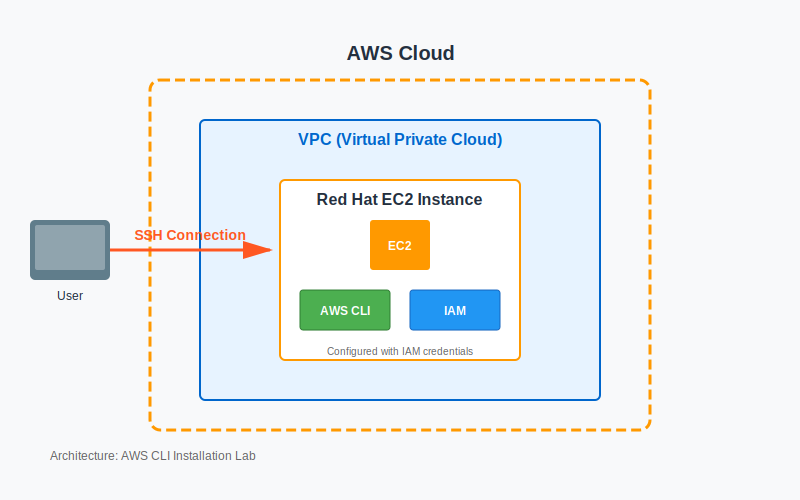

# AWS CLI Installation and Configuration Lab


## 📋 Descripción del Laboratorio

Este laboratorio demuestra la instalación y configuración del AWS Command Line Interface (AWS CLI) en una instancia Red Hat Linux EC2. El AWS CLI es una herramienta de línea de comandos que proporciona una interfaz para interactuar con productos y servicios de Amazon Web Services.

## 🎯 Objetivos

Al completar este laboratorio, se logra:

- ✅ Instalar y configurar el AWS CLI en una instancia Red Hat Linux
- ✅ Conectar el AWS CLI a una cuenta de AWS usando credenciales IAM
- ✅ Acceder y gestionar IAM utilizando el AWS CLI
- ✅ Practicar comandos básicos del AWS CLI para interactuar con servicios AWS

## 🏗️ Arquitectura



La arquitectura implementada incluye:

- **VPC (Virtual Private Cloud)**: Red virtual aislada en AWS
- **Instancia EC2 Red Hat**: Servidor Linux donde se instala el AWS CLI
- **Conexión SSH**: Acceso seguro a la instancia EC2
- **IAM (Identity and Access Management)**: Gestión de permisos y accesos
- **AWS CLI**: Herramienta de línea de comandos configurada con credenciales IAM

## 📁 Estructura del Proyecto

```
aws-cli-installation-lab/
├── README.md                      # Este archivo
├── docs/
│   ├── step-by-step-guide.md     # Guía detallada paso a paso
│   ├── commands-reference.md      # Referencia de comandos utilizados
│   └── results.md                 # Resultados y conclusiones
├── scripts/
│   └── install-aws-cli.sh        # Script de instalación del AWS CLI
├── policies/
│   └── lab_policy.json           # Política IAM del laboratorio
└── assets/
    └── architecture-diagram.png   # Diagrama de arquitectura
```

## 🚀 Inicio Rápido

### Prerrequisitos

- Cuenta de AWS (AWS Academy Lab o cuenta personal)
- Instancia EC2 Red Hat Linux
- Archivo de clave privada (.pem) para conexión SSH
- Credenciales IAM (Access Key ID y Secret Access Key)

### Pasos Principales

1. **Conectar a la instancia EC2 vía SSH**
   ```bash
   ssh -i labsuser.pem ec2-user@<PUBLIC-IP>
   ```

2. **Instalar AWS CLI**
   ```bash
   curl "https://awscli.amazonaws.com/awscli-exe-linux-x86_64.zip" -o "awscliv2.zip"
   unzip -u awscliv2.zip
   sudo ./aws/install
   ```

3. **Configurar AWS CLI**
   ```bash
   aws configure
   ```

4. **Verificar configuración**
   ```bash
   aws iam list-users
   ```

Para instrucciones detalladas, consulta la [Guía Paso a Paso](./docs/step-by-step-guide.md).

## 📚 Documentación

- **[Guía Paso a Paso](./docs/step-by-step-guide.md)**: Instrucciones detalladas de cada tarea
- **[Referencia de Comandos](./docs/commands-reference.md)**: Lista completa de comandos utilizados
- **[Resultados](./docs/results.md)**: Resultados obtenidos y conclusiones

## 🔑 Conceptos Clave Aprendidos

- **AWS CLI**: Herramienta poderosa para gestionar servicios AWS desde la línea de comandos
- **Autenticación**: Diferencia entre credenciales de consola (usuario/contraseña) vs CLI (Access Key/Secret Key)
- **IAM**: Gestión de políticas y permisos para usuarios y servicios
- **SSH**: Conexión segura a instancias EC2 remotas

## 🛠️ Tecnologías Utilizadas

- **AWS EC2**: Instancia Red Hat Linux
- **AWS CLI v2**: Herramienta de línea de comandos
- **AWS IAM**: Gestión de identidades y accesos
- **SSH**: Protocolo de conexión segura
- **Linux**: Sistema operativo Red Hat

## 📊 Resultados

- ✅ AWS CLI instalado exitosamente en Red Hat Linux
- ✅ Configuración completada con credenciales IAM
- ✅ Conexión establecida con cuenta AWS
- ✅ Comandos IAM ejecutados correctamente
- ✅ Política `lab_policy` descargada en formato JSON

## 🎓 Recursos Adicionales

- [Documentación oficial AWS CLI](https://docs.aws.amazon.com/cli/latest/userguide/cli-chap-welcome.html)
- [IAM AWS CLI Command Reference](https://docs.aws.amazon.com/cli/latest/reference/iam/)
- [Installing or Updating the AWS CLI](https://docs.aws.amazon.com/cli/latest/userguide/getting-started-install.html)
- [AWS Training and Certification](https://aws.amazon.com/training/)

## 👤 Autor

Laboratorio completado como parte del portafolio de AWS

## 📝 Licencia

Este proyecto es para fines educativos y de documentación.

---

**Nota**: Este laboratorio fue realizado en un entorno AWS Academy Lab. Las credenciales y recursos son temporales y se eliminan al finalizar la sesión del laboratorio.
