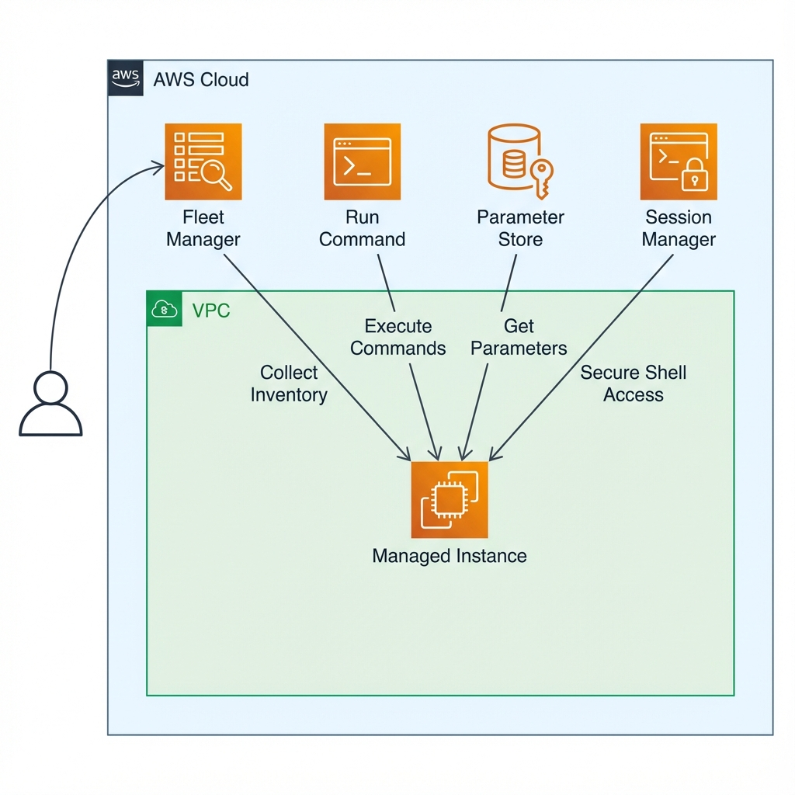

# AWS Systems Manager Lab


## 📋 Descripción del Laboratorio

Este laboratorio demuestra el uso de AWS Systems Manager para centralizar datos operacionales y automatizar tareas en recursos de AWS. Systems Manager permite configurar y gestionar instancias EC2, servidores on-premises, máquinas virtuales y otros recursos de AWS a escala.

## 🎯 Objetivos

Al completar este laboratorio, se logra:

- ✅ Verificar configuraciones y permisos de instancias administradas
- ✅ Ejecutar tareas en múltiples servidores usando Run Command
- ✅ Actualizar configuraciones de aplicaciones usando Parameter Store
- ✅ Acceder a la línea de comandos de una instancia mediante Session Manager
- ✅ Generar inventarios de software y configuraciones con Fleet Manager

## 🏗️ Arquitectura



La arquitectura implementada incluye:

- **VPC (Virtual Private Cloud)**: Red virtual aislada en AWS
- **Instancia EC2 Administrada**: Servidor con el agente de Systems Manager instalado
- **Fleet Manager**: Recopilación de inventario de sistemas operativos y aplicaciones
- **Run Command**: Ejecución remota de comandos sin SSH
- **Parameter Store**: Almacenamiento seguro de parámetros de configuración
- **Session Manager**: Acceso seguro a la línea de comandos sin puertos de entrada abiertos

## 📁 Estructura del Proyecto

```
02-aws-systems-manager/
├── README.md                      # Este archivo
├── docs/
│   ├── step-by-step-guide.md     # Guía detallada paso a paso
│   ├── commands-reference.md      # Referencia de comandos utilizados
│   └── results.md                 # Resultados y conclusiones
├── scripts/
│   └── install-dashboard.sh      # Script de instalación de la aplicación
├── policies/
│   └── ssm-instance-profile.json # Política IAM para Systems Manager
└── assets/
    └── architecture-diagram.png   # Diagrama de arquitectura
```

## 🚀 Inicio Rápido

### Prerrequisitos

- Cuenta de AWS (AWS Academy Lab o cuenta personal)
- Instancia EC2 con el agente de Systems Manager instalado
- Rol IAM con permisos de Systems Manager

### Tareas Principales

1. **Generar inventario de instancias administradas**
   - Configurar Fleet Manager para recopilar información del sistema
   - Revisar aplicaciones instaladas y configuraciones

2. **Instalar aplicación personalizada con Run Command**
   - Usar Run Command para instalar Widget Manufacturing Dashboard
   - Verificar la instalación sin acceso SSH

3. **Gestionar configuraciones con Parameter Store**
   - Crear parámetros para activar funciones de la aplicación
   - Actualizar configuraciones dinámicamente

4. **Acceder a instancias con Session Manager**
   - Conectar a la línea de comandos sin SSH
   - Ejecutar comandos de forma segura y auditable

Para instrucciones detalladas, consulta la [Guía Paso a Paso](./docs/step-by-step-guide.md).

## 📚 Documentación

- **[Guía Paso a Paso](./docs/step-by-step-guide.md)**: Instrucciones detalladas de cada tarea
- **[Referencia de Comandos](./docs/commands-reference.md)**: Lista completa de comandos utilizados
- **[Resultados](./docs/results.md)**: Resultados obtenidos y conclusiones

## 🔑 Conceptos Clave Aprendidos

- **Fleet Manager**: Recopilación centralizada de inventario de instancias sin necesidad de conectarse individualmente
- **Run Command**: Ejecución remota de scripts y comandos en múltiples instancias simultáneamente
- **Parameter Store**: Almacenamiento jerárquico y seguro de datos de configuración y secretos
- **Session Manager**: Acceso seguro a instancias sin puertos SSH abiertos ni bastion hosts
- **Automatización**: Gestión de infraestructura a escala sin acceso manual a cada servidor

## 🛠️ Tecnologías Utilizadas

- **AWS Systems Manager**: Plataforma de gestión centralizada
- **AWS EC2**: Instancia administrada
- **Fleet Manager**: Gestión de inventario
- **Run Command**: Ejecución remota de comandos
- **Parameter Store**: Gestión de configuraciones
- **Session Manager**: Acceso seguro a instancias
- **IAM**: Gestión de identidades y permisos

## 📊 Resultados

- ✅ Inventario de instancia configurado con Fleet Manager
- ✅ Aplicación web instalada usando Run Command
- ✅ Parámetros de configuración gestionados con Parameter Store
- ✅ Acceso seguro a instancia mediante Session Manager
- ✅ Gestión de infraestructura sin acceso SSH tradicional

## 🎓 Recursos Adicionales

- [What is AWS Systems Manager?](https://docs.aws.amazon.com/systems-manager/latest/userguide/what-is-systems-manager.html)
- [AWS Systems Manager Session Manager](https://docs.aws.amazon.com/systems-manager/latest/userguide/session-manager.html)
- [AWS Systems Manager Parameter Store](https://docs.aws.amazon.com/systems-manager/latest/userguide/systems-manager-parameter-store.html)
- [AWS Systems Manager Run Command](https://docs.aws.amazon.com/systems-manager/latest/userguide/execute-remote-commands.html)
- [AWS Training and Certification](https://aws.amazon.com/training/)

## 👤 Autor

Laboratorio completado como parte del portafolio de AWS

## 📝 Licencia

Este proyecto es para fines educativos y de documentación.

---

**Nota**: Este laboratorio fue realizado en un entorno AWS Academy Lab. Las credenciales y recursos son temporales y se eliminan al finalizar la sesión del laboratorio.
