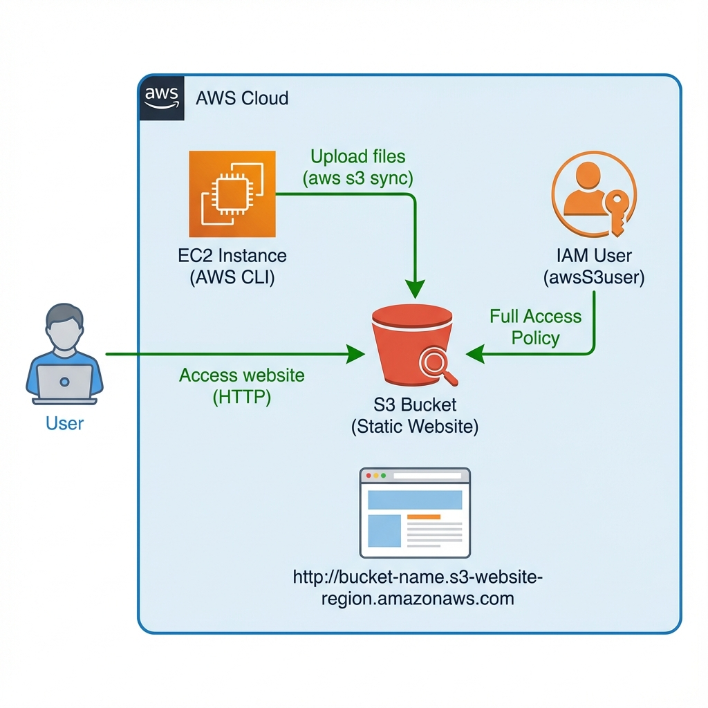

# Creating a Website on S3


## 📋 Descripción del Laboratorio

Este laboratorio demuestra cómo crear y desplegar un sitio web estático en Amazon S3 utilizando AWS CLI. Aprenderás a configurar buckets de S3, gestionar permisos IAM, y automatizar el despliegue de contenido web mediante scripts.

## 🎯 Objetivos

Al completar este laboratorio, se logra:

- ✅ Ejecutar comandos de AWS CLI para servicios IAM y Amazon S3
- ✅ Crear y configurar un bucket de S3 para hosting de sitios web estáticos
- ✅ Crear usuarios IAM con acceso completo a Amazon S3
- ✅ Desplegar un sitio web estático en un bucket de S3
- ✅ Crear scripts de automatización para actualizar el sitio web
- ✅ Gestionar permisos y ACLs de objetos en S3

## 🏗️ Arquitectura



La arquitectura implementada incluye:

- **EC2 Instance**: Instancia Linux con AWS CLI configurado
- **S3 Bucket**: Almacenamiento de archivos del sitio web estático
- **IAM User**: Usuario con permisos completos de S3
- **Static Website**: Sitio web del Café & Bakery accesible públicamente
- **Deployment Script**: Script bash para automatizar actualizaciones

## 📁 Estructura del Proyecto

```
03-s3-static-website/
├── README.md                      # Este archivo
├── docs/
│   ├── step-by-step-guide.md     # Guía detallada paso a paso
│   ├── commands-reference.md      # Referencia de comandos utilizados
│   └── results.md                 # Resultados y conclusiones
├── scripts/
│   └── update-website.sh         # Script de actualización del sitio
├── policies/
│   └── s3-full-access-policy.json # Política IAM para S3
└── assets/
    └── architecture-diagram.png   # Diagrama de arquitectura
```

## 🚀 Inicio Rápido

### Prerrequisitos

- Cuenta de AWS (AWS Academy Lab o cuenta personal)
- Instancia EC2 con AWS CLI instalado
- Credenciales IAM configuradas
- Archivos del sitio web estático

### Pasos Principales

1. **Conectar a la instancia EC2 vía Session Manager**
   ```bash
   # Conexión automática vía SSM
   ```

2. **Configurar AWS CLI**
   ```bash
   aws configure
   ```

3. **Crear bucket de S3**
   ```bash
   aws s3api create-bucket --bucket <my-bucket> --region us-west-2 \
     --create-bucket-configuration LocationConstraint=us-west-2
   ```

4. **Crear usuario IAM con acceso a S3**
   ```bash
   aws iam create-user --user-name awsS3user
   aws iam attach-user-policy --policy-arn arn:aws:iam::aws:policy/AmazonS3FullAccess \
     --user-name awsS3user
   ```

5. **Configurar bucket para hosting web**
   ```bash
   aws s3 website s3://<my-bucket>/ --index-document index.html
   ```

6. **Subir archivos del sitio web**
   ```bash
   aws s3 cp ./static-website/ s3://<my-bucket>/ --recursive --acl public-read
   ```

Para instrucciones detalladas, consulta la [Guía Paso a Paso](./docs/step-by-step-guide.md).

## 📚 Documentación

- **[Guía Paso a Paso](./docs/step-by-step-guide.md)**: Instrucciones detalladas de cada tarea
- **[Referencia de Comandos](./docs/commands-reference.md)**: Lista completa de comandos utilizados
- **[Resultados](./docs/results.md)**: Resultados obtenidos y conclusiones

## 🔑 Conceptos Clave Aprendidos

- **S3 Static Website Hosting**: Configuración de buckets para servir contenido web estático
- **IAM User Management**: Creación y gestión de usuarios con políticas específicas
- **S3 ACLs**: Control de acceso a nivel de objeto para contenido público
- **AWS CLI Automation**: Creación de scripts para automatizar despliegues
- **S3 Sync vs Copy**: Optimización de transferencias de archivos

## 🛠️ Tecnologías Utilizadas

- **Amazon S3**: Almacenamiento de objetos y hosting web estático
- **AWS CLI**: Herramienta de línea de comandos
- **AWS IAM**: Gestión de identidades y accesos
- **Session Manager**: Acceso seguro a instancias EC2
- **Bash Scripting**: Automatización de tareas

## 📊 Resultados

- ✅ Bucket de S3 creado y configurado para hosting web
- ✅ Usuario IAM con permisos de S3 creado exitosamente
- ✅ Sitio web estático desplegado y accesible públicamente
- ✅ Script de automatización creado para actualizaciones
- ✅ Optimización con `aws s3 sync` implementada

## 🎓 Recursos Adicionales

- [S3 API Documentation](https://docs.aws.amazon.com/AmazonS3/latest/API/Welcome.html)
- [Hosting a Static Website on Amazon S3](https://docs.aws.amazon.com/AmazonS3/latest/userguide/WebsiteHosting.html)
- [AWS CLI S3 Commands](https://docs.aws.amazon.com/cli/latest/reference/s3/)
- [AWS CLI S3 Sync](https://docs.aws.amazon.com/cli/latest/reference/s3/sync.html)
- [AWS Training and Certification](https://aws.amazon.com/training/)

## 👤 Autor

Laboratorio completado como parte del portafolio de AWS

## 📝 Licencia

Este proyecto es para fines educativos y de documentación.

---

**Nota**: Este laboratorio fue realizado en un entorno AWS Academy Lab. Las credenciales y recursos son temporales y se eliminan al finalizar la sesión del laboratorio.
