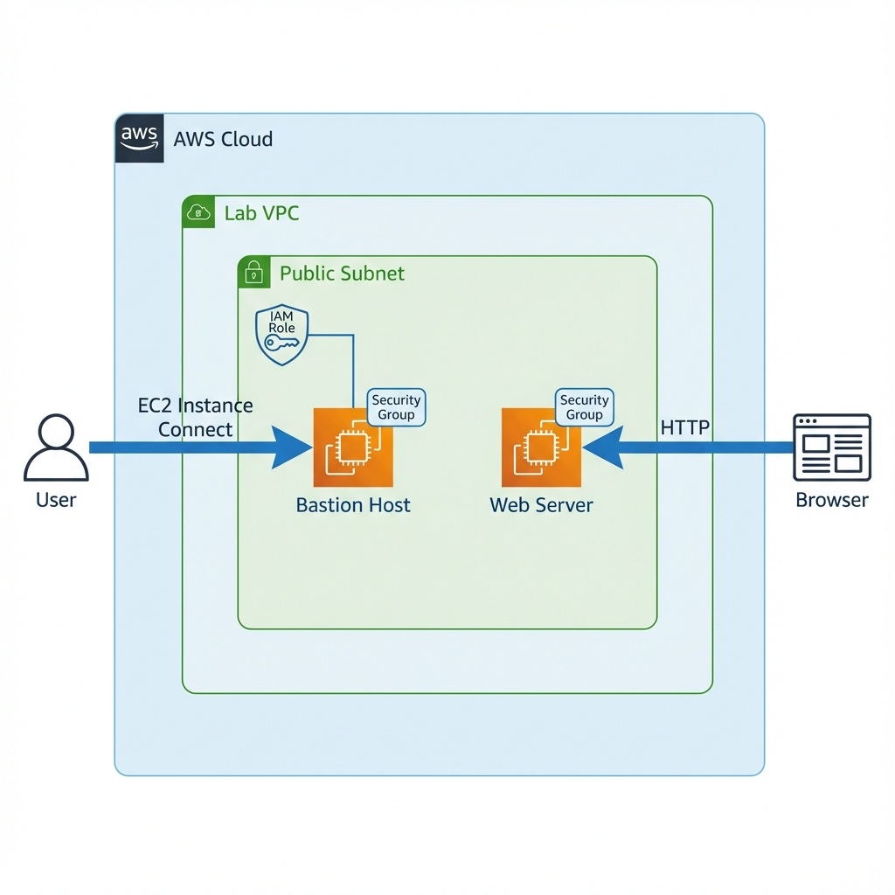

# Creating Amazon EC2 Instances


## 📋 Descripción del Laboratorio

Este laboratorio demuestra múltiples formas de lanzar instancias Amazon EC2. Aprenderás a crear instancias usando la consola de AWS Management y AWS CLI, configurar bastion hosts, implementar servidores web con user data, y automatizar el despliegue de infraestructura.

## 🎯 Objetivos

Al completar este laboratorio, se logra:

- ✅ Lanzar instancias EC2 usando AWS Management Console
- ✅ Conectar a instancias EC2 usando EC2 Instance Connect
- ✅ Lanzar instancias EC2 usando AWS CLI
- ✅ Configurar bastion hosts para acceso seguro
- ✅ Implementar servidores web con user data scripts
- ✅ Automatizar el aprovisionamiento de recursos con scripts

## 🏗️ Arquitectura



La arquitectura implementada incluye:

- **VPC (Lab VPC)**: Red virtual privada con subnet pública
- **Bastion Host**: Instancia EC2 para acceso administrativo
- **Web Server**: Instancia EC2 con Apache configurado
- **Security Groups**: Control de acceso de red
- **IAM Role**: Permisos para ejecutar AWS CLI
- **EC2 Instance Connect**: Acceso seguro sin claves SSH

## 📁 Estructura del Proyecto

```
04-ec2-instances/
├── README.md                      # Este archivo
├── docs/
│   ├── step-by-step-guide.md     # Guía detallada paso a paso
│   ├── commands-reference.md      # Referencia de comandos utilizados
│   └── results.md                 # Resultados y conclusiones
├── scripts/
│   ├── UserData.txt              # Script de configuración del servidor web
│   └── launch-web-server.sh      # Script de lanzamiento automatizado
├── policies/
│   └── bastion-role-policy.json  # Política IAM para bastion host
└── assets/
    └── architecture-diagram.png   # Diagrama de arquitectura
```

## 🚀 Inicio Rápido

### Prerrequisitos

- Cuenta de AWS (AWS Academy Lab o cuenta personal)
- VPC configurada con subnet pública
- Security groups configurados

### Pasos Principales

1. **Lanzar Bastion Host desde la consola**
   - Configurar nombre y tags
   - Seleccionar AMI (Amazon Linux 2)
   - Elegir tipo de instancia (t3.micro)
   - Configurar red y security group
   - Asignar IAM role

2. **Conectar al Bastion Host**
   ```bash
   # Usar EC2 Instance Connect desde la consola
   ```

3. **Lanzar Web Server con AWS CLI**
   ```bash
   # Obtener AMI ID
   AMI=$(aws ssm get-parameters --names /aws/service/ami-amazon-linux-latest/amzn2-ami-hvm-x86_64-gp2 --query 'Parameters[0].[Value]' --output text)
   
   # Lanzar instancia
   aws ec2 run-instances --image-id $AMI --instance-type t3.micro --user-data file://UserData.txt
   ```

Para instrucciones detalladas, consulta la [Guía Paso a Paso](./docs/step-by-step-guide.md).

## 📚 Documentación

- **[Guía Paso a Paso](./docs/step-by-step-guide.md)**: Instrucciones detalladas de cada tarea
- **[Referencia de Comandos](./docs/commands-reference.md)**: Lista completa de comandos utilizados
- **[Resultados](./docs/results.md)**: Resultados obtenidos y conclusiones

## 🔑 Conceptos Clave Aprendidos

- **EC2 Instance Types**: Selección de tipos de instancia según necesidades
- **AMI Selection**: Uso de Amazon Machine Images
- **Security Groups**: Configuración de firewalls virtuales
- **IAM Roles**: Asignación de permisos a instancias
- **User Data**: Automatización de configuración inicial
- **Bastion Hosts**: Arquitectura de acceso seguro
- **AWS CLI Automation**: Lanzamiento programático de instancias

## 🛠️ Tecnologías Utilizadas

- **Amazon EC2**: Servicio de computación en la nube
- **AWS CLI**: Herramienta de línea de comandos
- **AWS Systems Manager**: Parameter Store para AMIs
- **EC2 Instance Connect**: Acceso seguro basado en navegador
- **IAM**: Gestión de identidades y permisos
- **Apache HTTP Server**: Servidor web

## 📊 Resultados

- ✅ Bastion host lanzado desde la consola
- ✅ Conexión exitosa vía EC2 Instance Connect
- ✅ Web server lanzado con AWS CLI
- ✅ Servidor web configurado automáticamente con user data
- ✅ Aplicación web accesible públicamente

## 🎓 Recursos Adicionales

- [Launch Your Instance](https://docs.aws.amazon.com/AWSEC2/latest/UserGuide/LaunchingAndUsingInstances.html)
- [Connect to Your Linux Instance Using EC2 Instance Connect](https://docs.aws.amazon.com/AWSEC2/latest/UserGuide/Connect-using-EC2-Instance-Connect.html)
- [Amazon EC2 User Data and Shell Scripts](https://docs.aws.amazon.com/AWSEC2/latest/UserGuide/user-data.html)
- [AWS CLI EC2 Commands](https://docs.aws.amazon.com/cli/latest/reference/ec2/)
- [AWS Training and Certification](https://aws.amazon.com/training/)

## 👤 Autor

Laboratorio completado como parte del portafolio de AWS

## 📝 Licencia

Este proyecto es para fines educativos y de documentación.

---

**Nota**: Este laboratorio fue realizado en un entorno AWS Academy Lab. Las credenciales y recursos son temporales y se eliminan al finalizar la sesión del laboratorio.
